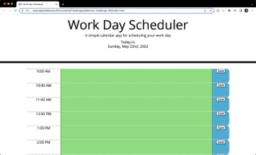

# Work Day Scheduler
Given the basic code and a mockup, I was tasked with refactoring exosting code to add functionality to a daily planner app.

## Changes to the Code
Initially, I tried creating 
 elements for each individual timeblock. After spending a good amount of time on that, I decided it would be easier to implement the ability to change the color of the timeblocks according to the time of day if the HTML was dynamically generated. I also wanted to keep my code in line with the D.R.Y. principle. Because of this, I wasted time and was unable to add functionality with local storage. I feel like I learned more from the mistakes I made than the solutions I came up with. In the future, I will try to think critically about the project earlier, rather than going into "autopilot" for the setup/basic HTML.

## Screenshots
